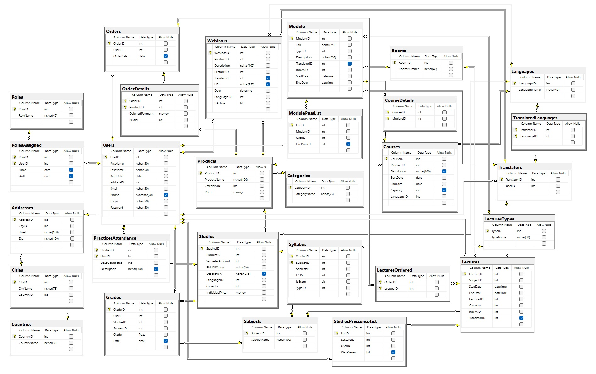

# Projekt Systemu Bazodanowego dla Firmy Szkoleniowej

## Wstęp
Firma szkoleniowa oferująca kursy i szkolenia zdecydowała się na opracowanie systemu bazodanowego, aby zarządzać swoimi usługami. System musi uwzględniać zarówno stacjonarny, jak i zdalny charakter oferowanych szkoleń oraz integrację z systemem płatności.

## Podział usług
1. **Webinary:**
   - Przebiegają na żywo na platformie chmurowej, nagrania są dostępne przez 30 dni.
   - Mogą być darmowe lub płatne.
   - Wymagają potwierdzenia płatności.
   
2. **Kursy:**
   - Trwają zazwyczaj kilka dni.
   - Wymagają zaliczenia min. 80% modułów.
   - Moduły mogą być stacjonarne, online synchroniczne, online asynchroniczne lub hybrydowe.
   
3. **Studia:**
   - Długotrwałe formy kształcenia z praktykami i egzaminem końcowym.
   - Wymagają zaliczenia min. 80% zajęć i 100% praktyk.

## Integracja z systemem płatności
- Uczestnicy mogą dodawać produkty do koszyka i opłacać je przez generowane linki.
- Dostęp do webinarów możliwy jest po opłaceniu.
- Uczestnictwo w kursach i studiach wymaga wpłaty zaliczki lub całej kwoty.

## Raportowanie
1. **Raporty finansowe**
2. **Lista "dłużników"**
3. **Raporty dotyczące liczby zapisanych osób**
4. **Raporty dotyczące frekwencji**
5. **Lista obecności**
6. **Raport bilokacji**

## Wymagane elementy w projekcie
- Propozycja funkcji systemu, projekt bazy danych, zdefiniowanie bazy danych.
- Warunki integralności, struktura widoków ułatwiających dostęp do danych.
- Operacje na danych (procedury składowane, triggery, funkcje).
- Propozycja indeksów i określenie uprawnień do danych.

## Sprawozdanie
- Opis funkcji systemu i możliwości użytkowników.
- Schemat bazy danych, warunki integralnościowe, procedury, triggery, widoki.
- Wygenerowane dane, uprawnienia do danych, indeksy.

## Implementacja
Projekt zostanie zaimplementowany przy użyciu MS SQL Server.

# Zaproponowany schemat bazy danych

# Widoki, funkcje, procedury, triggery, indexy w sprawozdaniu 

# Autorzy:
## Jakub Konopka
## Mateusz Bobula
## Norbert Dziwak
